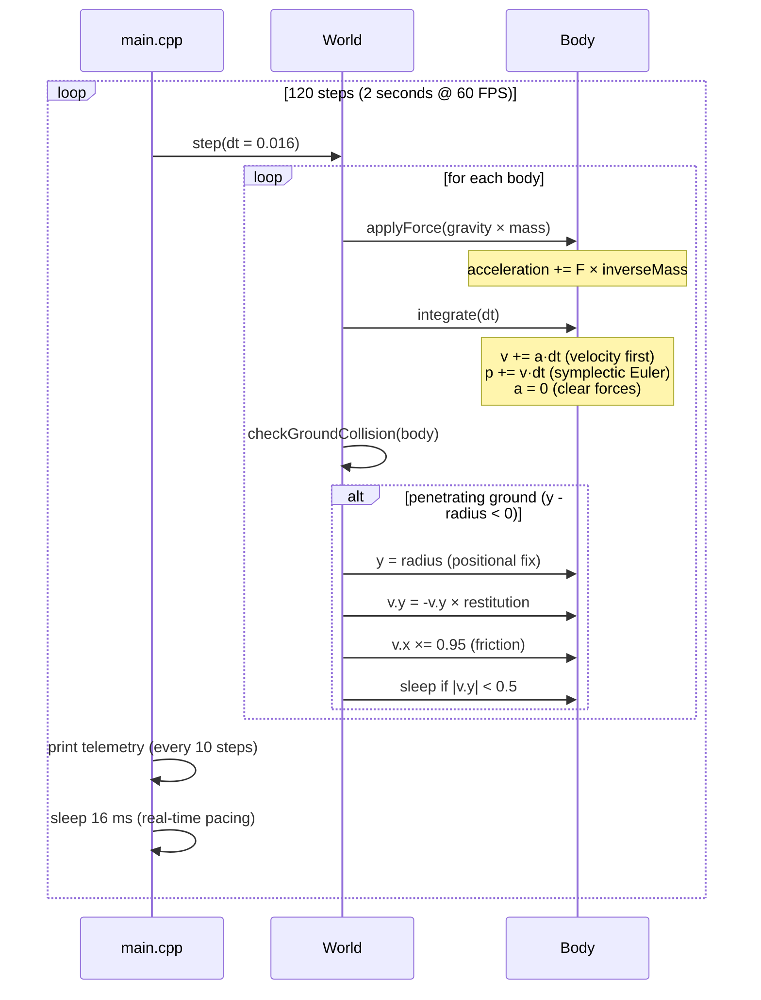

# ⚙️ C++ Game Physics Engine


> A lightweight, modern **C++17 2D rigid-body physics engine** featuring force accumulation, symplectic Euler integration, gravity, restitution-based ground collision, and friction — demonstrated through a real-time terminal simulation of a bouncing ball.

   

---

## ✨ Features

- **Rigid body dynamics** — mass, inverse-mass (static bodies via `inverseMass == 0`), velocity, acceleration
- **Force accumulation model** — `applyForce()` accumulates forces per frame, cleared after integration
- **Symplectic Euler integration** — semi-implicit integration for real-time simulation
- **Gravity simulation** — world-level gravity `(0, -9.81 m/s²)` applied per-body scaled by mass
- **Ground collision & restitution** — positional correction, velocity reflection with configurable bounciness, and a sleep threshold to stop micro-bouncing
- **Friction approximation** — horizontal velocity damping (5%) on ground contact
- **Fixed-timestep loop** — 60 FPS (`dt = 0.016s`) with real-time pacing via `std::this_thread::sleep_for`
- **CMake build system** — C++17, single-target build

---

## 🏗️ Architecture — How It Works

The engine is organized into three focused modules under `src/`:

```
src/
├── main.cpp            # Demo: simulates a bouncing ball for 2 seconds at 60 FPS
├── math/
│   └── vec2.h          # 2D vector: arithmetic, length, normalize, stream output
└── physics/
    ├── body.h          # Rigid body: forces, mass, restitution, integration
    └── world.h         # World: gravity, body registry, stepping, ground collision
```

```mermaid
flowchart TD
    subgraph Entry["🎬 Entry Point"]
        M["main.cpp<br/>Creates World + Ball<br/>Runs 120-step loop @ 60 FPS"]
    end

    subgraph Core["⚙️ Physics Core"]
        W["World (world.h)<br/>• gravity (0, -9.81)<br/>• owns Body registry<br/>• step(dt)<br/>• checkGroundCollision()"]
        B["Body (body.h)<br/>• position / velocity / acceleration<br/>• mass & inverseMass<br/>• restitution & radius<br/>• applyForce() / integrate(dt)"]
        V["Vec2 (vec2.h)<br/>• +, -, scalar ×<br/>• length(), normalize()<br/>• operator<<"]
    end

    M -->|addBody| W
    M -->|world.step(dt)| W
    W -->|applyForce(gravity × mass)| B
    W -->|integrate(dt)| B
    W -->|resolve ground hit| B
    B -->|uses| V
    W -->|uses| V
```

### `Vec2` (`math/vec2.h`)
A minimal 2D vector struct supporting `+`, `-`, scalar multiplication, `length()`, in-place `normalize()`, and `operator<<` for debugging. This is the mathematical foundation for all positions, velocities, and forces.

### `Body` (`physics/body.h`)
Represents a circular rigid body with `position`, `velocity`, `acceleration`, `mass`, `inverseMass`, `restitution` (bounciness in `[0, 1]`), and `radius`.

- **`applyForce(force)`** — converts force to acceleration via Newton's second law (`a = F × inverseMass`) and *accumulates* it. Bodies with `inverseMass == 0` are static and ignore forces.
- **`integrate(dt)`** — performs **symplectic (semi-implicit) Euler**: velocity is updated first, then position uses the *new* velocity. Acceleration is reset afterward, so forces must be re-applied each frame.

### `World` (`physics/world.h`)
Owns all bodies (raw pointers, deleted in the destructor) and drives simulation:

- **`step(dt)`** — for each body: applies gravity as a force (`gravity × mass`, so acceleration is mass-independent), integrates, then resolves ground collision.
- **`checkGroundCollision(body)`** — when the body's bottom edge (`position.y - radius`) penetrates the ground plane (`y = 0`):
  1. **Positional correction** — snaps the body back to the surface.
  2. **Restitution response** — reflects vertical velocity scaled by `restitution`.
  3. **Friction approximation** — damps horizontal velocity by 5% per contact.
  4. **Sleep threshold** — zeroes vertical velocity below `0.5 m/s` to prevent jitter.

### Per-Frame Simulation Pipeline



### Simulation loop (`main.cpp`)
Creates a `World`, spawns a ball at `(0, 10)` with mass `1.0`, radius `0.5`, and initial horizontal velocity `(2, 0)`. It runs 120 fixed steps of `dt = 0.016s` (2 simulated seconds), printing position/velocity telemetry every 10 steps and sleeping ~16 ms per frame to run in real time.

---

## 🚀 Building & Running (Native)

**Requirements:** CMake ≥ 3.10, a C++17 compiler (GCC, Clang, or MSVC).

```bash
mkdir build && cd build
cmake ..
cmake --build .
./PhysicsEngine
```

**Expected output:** a telemetry table of the ball's position and velocity as it falls, bounces, and settles:

```
Starting Simulation...
Time(s) | Position Y | Velocity Y
-----------------------------------
0s      | 10 m       | 0 m/s
0.16s   | 9.79 m     | -1.57 m/s
...
Simulation finished.
```

---

## 🐳 Running with Docker

> ⚠️ **Note:** The provided `Dockerfile` references `main.cpp` in the repository root (`RUN g++ -o engine main.cpp`), but the actual entry point lives in `src/main.cpp` with headers under `src/physics/` and `src/math/`. Update the Dockerfile to match the real layout:

```dockerfile
FROM gcc:latest
WORKDIR /app
COPY . .
RUN g++ -std=c++17 -I src -o engine src/main.cpp
CMD ["./engine"]
```

Then build and run:

```bash
docker build -t cpp-game-physics-engine .
docker run --rm cpp-game-physics-engine
```

### Alternative: CMake inside a container (no Dockerfile changes needed)

```bash
docker run --rm -v "$PWD":/app -w /app gcc:latest \
  bash -c "mkdir -p build && cd build && cmake .. && make && ./PhysicsEngine"
```

### docker-compose

The application is a single self-contained executable with no services or ports, so plain `docker build` / `docker run` is sufficient. A minimal compose file also works:

```yaml
services:
  physics-engine:
    build: .
    tty: true
```

```bash
docker-compose up --build
```

---

## 📄 License

Distributed under the **VisionQuantech Custom Commercial License** (see `LICENSE`):

- **Free** for personal, educational, and non-commercial use.
- **Revenue share (15–30%)** required for individual/indie commercial use.
- **Separate commercial license required** for business/enterprise use — contact **visionquantech@proton.me**.

THE SOFTWARE IS PROVIDED "AS IS", WITHOUT WARRANTY OF ANY KIND.